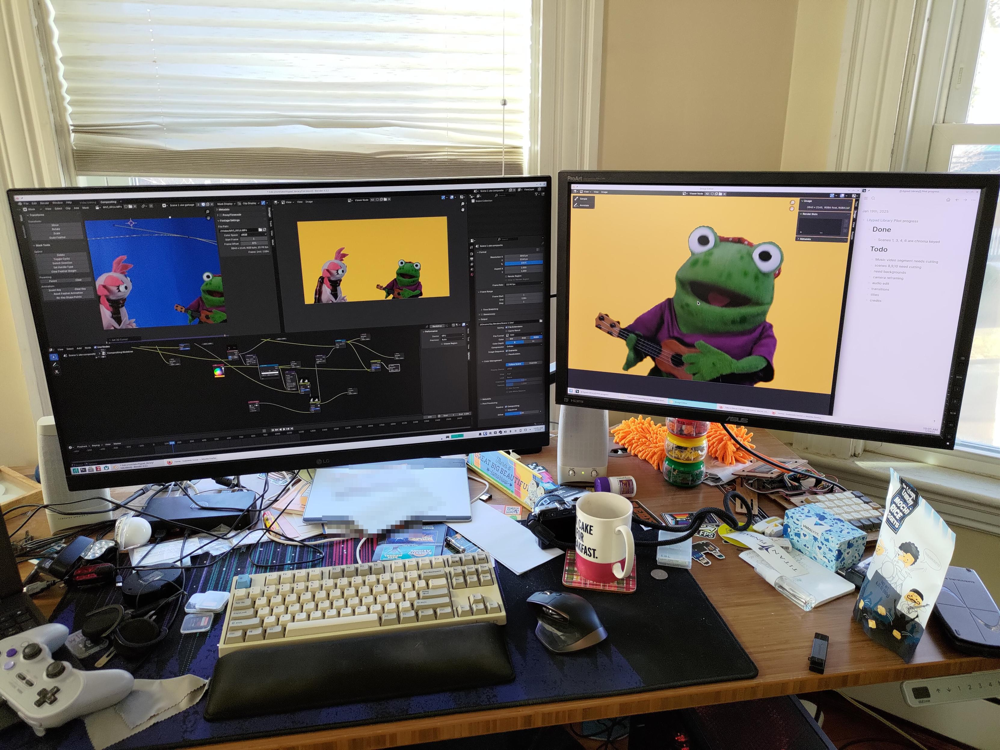

## 🛠️ Working On

I've been too busy for blogging, but that's because I've been shooting and now
editing the pilot for my wife's children's TV show *Lilypad Library!* It's a show
incorporating puppets and live actors to talk about neurodivergent issues and emotional
intelligence. I think she aims to be a Mr. Rogers for today's kids (not that Mr. Rogers has lost his relevance.)
She's going to show off this pilot in a few weeks at the KidScreen conference in San Diego,
so I'm working my butt off on it!

Here are some pictures from filming and during the editing process.

## 🌞 Touching Grass

I haven't been touching much grass, mostly shoveling snow and trying to stay
cozy.

## 🎧 Listening To

- John Williams
- Hans Zimmer

## 📖 Reading

### In Progress

Haven't been reading many "book" books, but recently I've been reading some miniature game rulebooks,
and I've been reading up a lot on some technical stuff for projects I've been thinking about starting.

Also reading the Pandas docs every day for work 😅

### Finished

- Joyland - Stephen King
- Lullabies for Little Criminals - Heather O'Neill
- [Rental Person Who Does Nothing](https://app.thestorygraph.com/books/c7b5f7a6-586d-4a42-b7f6-7bf8256279ed) - Shoji Morimoto
- Going Postal - Terry Pratchett (Audiobook)

## 📺 Watching

- Bob's Burgers
- Rick and Morty
- Austin Powers (I'd never seen them)
