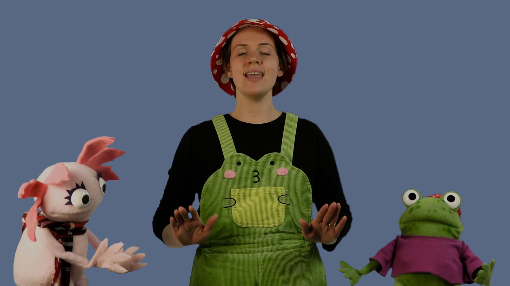

## 🛠️ Working On

My wife and I bought our first house! It was built in 1925, but most of the appliances were replaced
within the past few years. It has an amount of built-in storage space to match the year it was built,
but it's nothing a few trips to Ikea can't fix. I have discovered a minor leak which I need to go up
into the attic to investigate, but I remain optimistic. It's nice no longer being a tenant, and there's
something intoxicating about drilling holes in walls and making a place truly my own.

Home projects are now taking the majority of my free time, but I've found a few
hours to sit down and start playing the copy of [Earthborne Rangers](https://earthbornegames.com/the-game/) which we ordered about a year
ago on the recommendation of Shut Up and Sit Down's [glowing review](https://www.shutupandsitdown.com/videos/review-earthborne-rangers/).
It's sort of a piece of solarpunk future fantasy, which is a nice world to escape into with the help
of simple yet intricate deckbuilding mechanics.

I was able to finish the pilot for my wife's childrens television concept, *Lilypad Library* in
time for the Kidscreen conference where she pitched the project to a lot of interesting people who
seemed very interested in her work in turn. You can watch the pilot on [YouTube](https://www.youtube.com/watch?v=BpcV3pngPI8) 
and if you like it please share it with parents of young children and anyone
else who enjoys puppets sharing wisdom about mental health and inclusion.

## 🌞 Touching Grass

Still haven't touched much grass, but moving was a real workout. The weather is warming
up though, so I'm looking forward to getting out and exploring our new town by rollerblade.

## 🎧 Listening To

- [FTL Original Soundtrack](https://youtu.be/nbuXDKbWF9w?si=RxOXTVxTSMvfbKbi)
- [Tech Won't Save Us Podcast](https://www.techwontsave.us/)
- [Sports Team](https://music.youtube.com/channel/UCrEltYDBfDP10nmlca38-vA?si=lHt5x0s6CRHEmali)

## 📖 Reading

### In Progress

- Serling : the rise and twilight of television's last angry man

### Finished

- Joyland - Stephen King
- Lullabies for Little Criminals - Heather O'Neill
- [Rental Person Who Does Nothing](https://app.thestorygraph.com/books/c7b5f7a6-586d-4a42-b7f6-7bf8256279ed) - Shoji Morimoto
- Going Postal - Terry Pratchett (Audiobook)

## 📺 Watching

- Bob's Burgers
- Planetes
