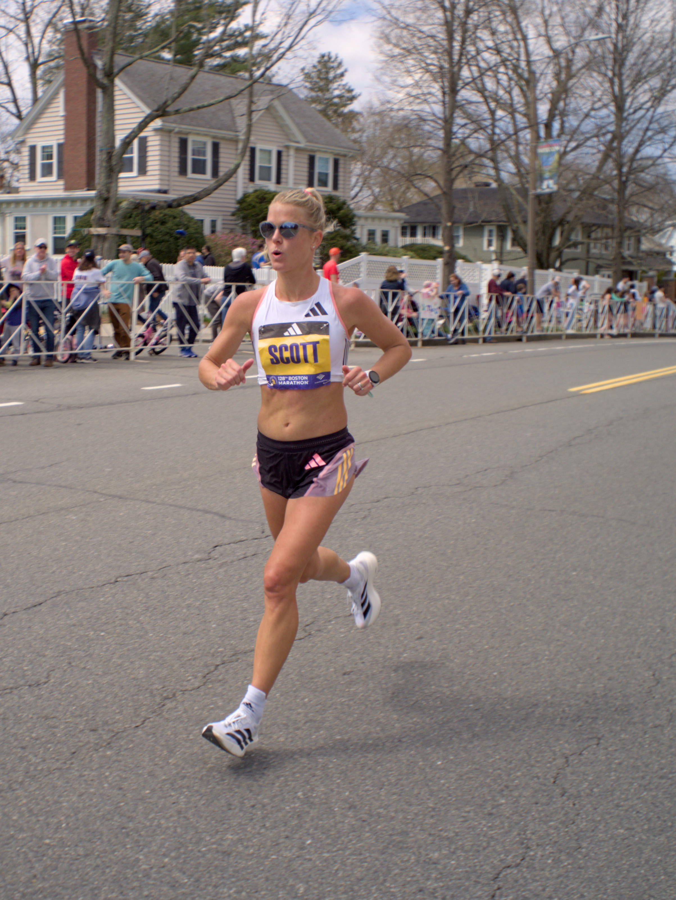


Since marathon day is a holiday in MA I laced up my skates and rolled over to Heartbreak Hill in Newton to take some photos.


## The Skates
I'm still getting used to my new 3x110mm wheel setup, so now that the weather is nice it's been good to get more time on them.
The other nice thing about following the route up Heartbreak Hill was getting to roll back down again. Only had to bail into the
grass once to survive a narrow section occupied by a family with a stroller. Definitely need to gain confidence with quicker stops
than a T-stop 😛

## The Camera
Since it's so easy to fit in a pocket and because there was plenty of light, I put the [Olympus 15mm f8 bodycap lens](https://www.youtube.com/watch?v=k4Y_sUv2gHw) 
onto my Olympus E-PM2. I don't have any particular opinion on the Micro Four Thirds format, it's just some equipment from my dad that fell into my lap. As I'm
getting into it, I'm enjoying what it does that my phone camera doesn't. Namely, it gives the control back to me rather than to whatever smoothing and upscaling
algorithms my phone decides to use.

Taking RAW photos and developing them in [Darktable](https://www.darktable.org/) (open-source lightroom software) has been a fun way to put some creativity back into photography rather than just
sharing whatever comes out of my phone camera untouched.

I've had a 256GB microSD card in the camera for some time, and I've finally passed under 9999 photos remaining!

## The Photos
Because of the fixed aperture of the bodycap lens, I couldn't really get long enough exposures for any motion-blurred panning shots. I did try that out initially but didn't
really get any good results. From there I just tried to snap anyone who was on my side of the road to get them filling the frame. I started out shooting near the Newton Library
and made my way toward the top of Heartbreak Hill. Here are my best shots in no particular order.

Maybe I'll skate the length of a marathon someday, but running is definitely not my thing. I enjoy watching though! It was a lovely day to get some fresh air and
snap some photos. I'm pretty happy with how they turned out.