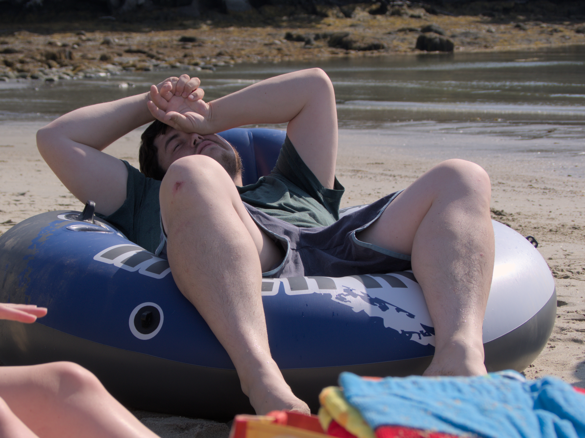

 I brought my camera on a trip to Chebeague Island in Maine, and I
had a lot of fun shooting with a few different lenses. 
Since the name of the game was relaxation without much in the way of specific
activities, it was the perfect trip to experiment with different lenses and
techniques. 

## The Kit

The kit I brought with me consisted of my Olympus *E-PM2* and four
lenses:

- Panasonic Lumix G Vario 45-200mm f/4.0-5.6
  [Telephoto](https://photographylife.com/lenses/panasonic-lumix-g-vario-45-200mm-f4-5-6-ois)
  with variable ND filter
- Olympus M.Zuiko 45mm f/1.8
  [Prime](https://photographylife.com/lenses/olympus-m-zuiko-digital-45mm-f1-8)
- Olympus 15mm f/8 [Body
  Cap](https://photographylife.com/lenses/olympus-15mm-f8-body-cap)
- Olympus M.Zuiko 14-42mm f/3.5-5.6 [Kit
  Zoom](https://photographylife.com/lenses/olympus-m-zuiko-digital-14-42mm-f3-5-5-6-ii-r)

## The Photos

### Friday

For the ferry journey to the island I had the bodycap lens on for
maneuverability and infinite focus. The image quality is objectively "bad" but I
enjoy the low-fidelity look it gives. It reminds me of a disposable camera
without having to build my own disposable-lens-in-bodycap lens. I took this shot
as we arrived at the dock, greeted by our friends Jake and Kevin. The golden
hour lighting highlights the subjects against the the sky.

Our ride from the dock to the house was a red Dodge Dakota with custom-built
benches in the bed. The wind in Kiersten's hair and the motion blur of the
greenery in the background makes this pic a lot of fun.

We tossed a frisbee around the yard before making dinner. The light was getting
low so I swapped the bodycap for the 45mm prime with the wide-open aperture. I
find the focal length of this lens a bit tricky to manage in more intimate
situations, but where I can get some distance from my subject the possibilities
afforded by the aperture are really interesting. Here I took an action shot of
Kevin as he tossed the frisbee my way. I don't recall whether I caught it or not
after getting the shot. The contrast is a little low, maybe I'll take another
crack at editing this one sometime.

### Saturday

On Saturday we headed for a sandy beach. I used my 45-200mm telephoto to get
shots of people out in the water, as well as to be ready in case of any distant
wildlife. I should have put the variable ND filter on to cut down on glare as a
polarizer, but I didn't think of it.

I elected to walk to the beach rather than cramming into the truck, so as I
arrived I took this shot through the foliage leading up to the beach. The lens
isn't super sharp at 200mm, but it was a pretty budget-friendly telephoto so I
can't really complain. I was playing with the framing of the blurry foliage in
the foreground but overall I don't love the composition of this shot. The dock
in the distance steals some focus from the main subjects, but there isn't really
enough contrast in the soft-looking people for an interesting shot if I were to
crop it out.

The floating dock had a rotating cast of characters throughout the day. I like
the warm tone of this picture with Lauren and Kiersten in the foreground and a
boat moored in the background. I feel like their sunglasses draw the eye making
a nice natural focal point, and the three distinct layers 

I enjoyed getting some photos of Megan taking photos of her own. Here she was
taking a picture of her dog, Teaser in the water, but I had to crop her out as
she wasn't really in focus or framed well in this shot.

Obligatory Teaser action shot 🐕

Folks were getting tired, and everyone found different ways of getting comfy. At
this point I swapped over to the 15mm bodycap again for some fun grunginess
in-camera. I enjoyed the "sardines in a can" pose here.

Kevin chose to lounge in an inflatable tube instead. This pose has a bit of an
"accidental renaissance" feel to it.

### Sunday

On sunday we went to a rocky area of the shoreline, and I enjoyed getting photos
of our friends climbing around and exploring. This time I remembered the
adjustable ND filter which really helped cut down on glare, as well as allowing
me to keep the depth of field shallow with a wider aperture without blowing out
the sensor or requiring a super fast shutter. Teaser enjoyed running around on
the uneven terrain, and here Kiersten and Teaser are out on the rocks framed
against the sea and another island in the background. There's a bit of yellow
foliage out of focus in the foreground. I was going for that, but not sure if I
really like the look.

The rocks provided a lof of nice opportunities for framing my shots. This one of
Lauren has the lower third covered by some interesting rocks. The rocks, sea,
island, and sky provide some interesting horizontal lines against the vertical
composition of the portrait.

The ND filter gave me some opportunities to try out long exposures. I wanted to
severely limit the light and expose for a second or two to get the motion of the
waves against the rocks. I didn't have a tripod with me so I was limited to
places where I could find a place to perch the camera where I could still see
the screen to compose the shot. If I had my viewfinder with me I would've had
some more options, but alas I did not. I ordered a Gorillapod after this trip
and I'll be bringing it as part of my kit in the future. This long exposure
turned out alright.

I really liked the colors of this passing ferry so I took a shot as it passed
the rocks.

We headed back to the house in the truck and I got this shot of Megan and Teaser
in the wind with the bodycap lens.

## Editing

The photos were edited with [Darktable](https://www.darktable.org/) and I mainly
worked with the exposure and contrast with some minor color adjustments. I also
added subtle vignetting to tie the set together. I feel like I may have erred on
the side of lower contrast and it could have been pushed more in some of the
photos. I was really trying to avoid the extremely contrasty look of photos with
default filters applied that one might post to Instagram from a phone camera. I
think the series conveys some warmth and the editing defintely differentiates
the photos from those I could take on my phone.

Overall my goal with picking up photography as a conscious activity was to do
things that I can't replicate with phone cameras because of the opaque layers of
processing applied to those pictures, and I'm happy with the results I was able
to get on this trip.

