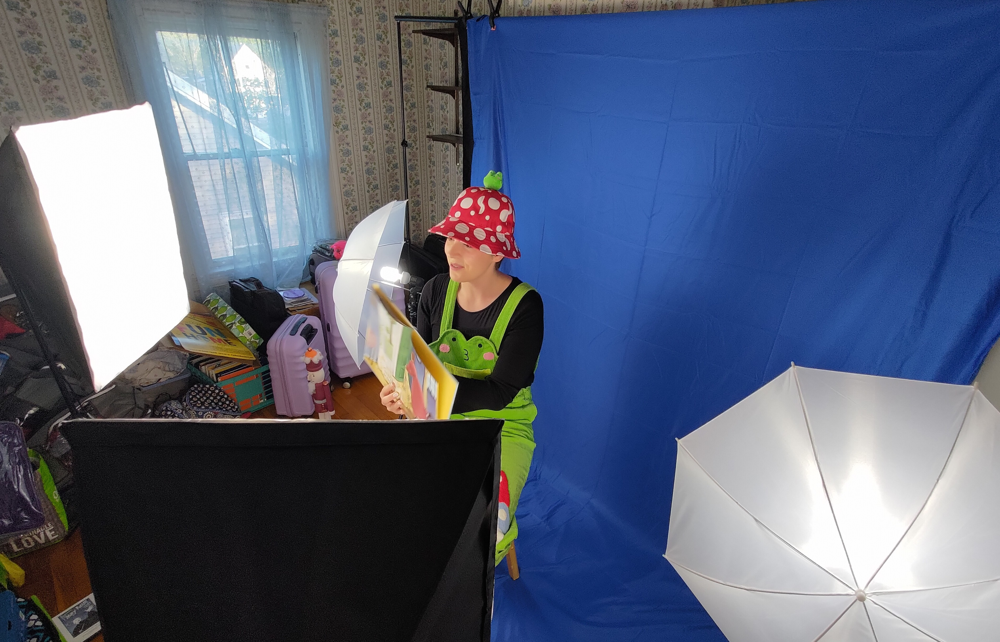
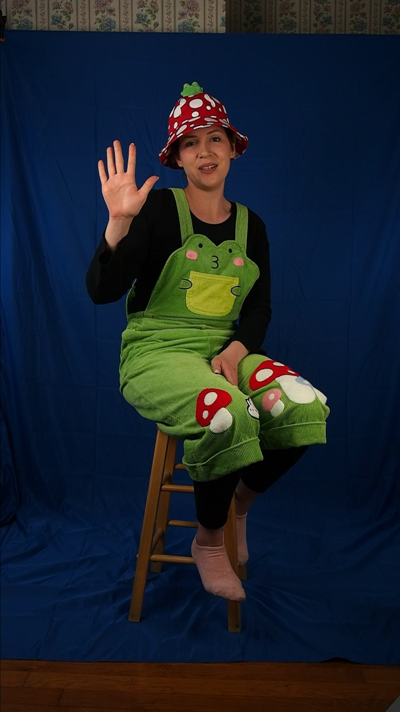
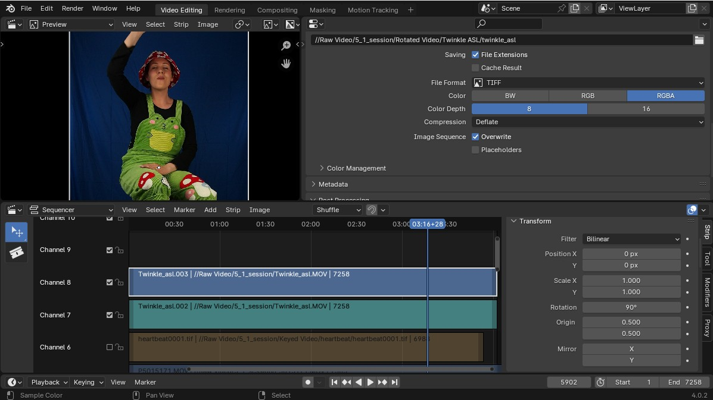
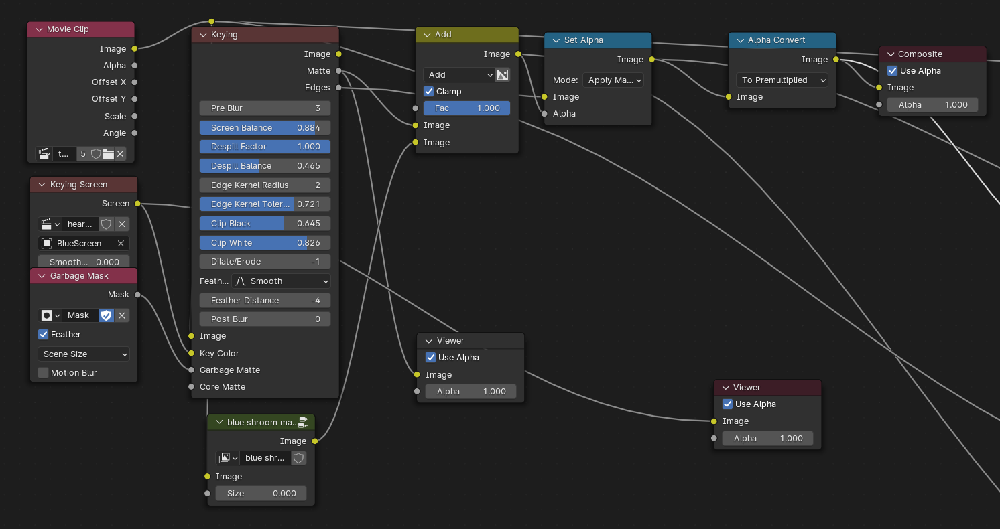
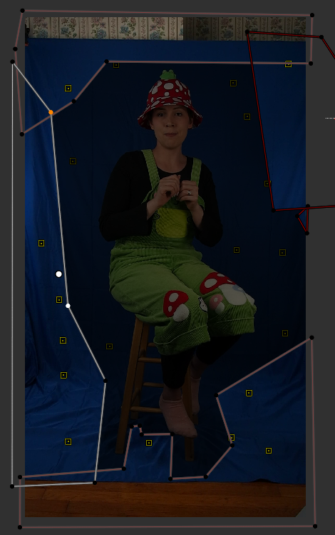
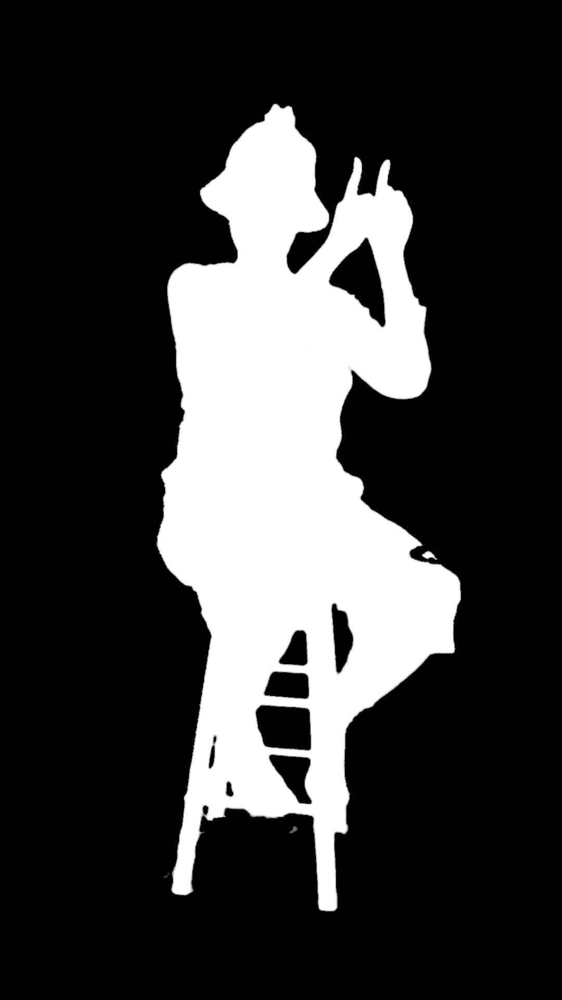
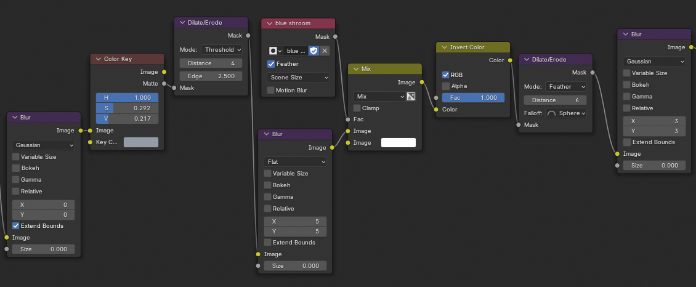
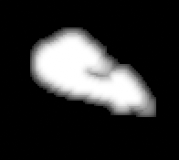
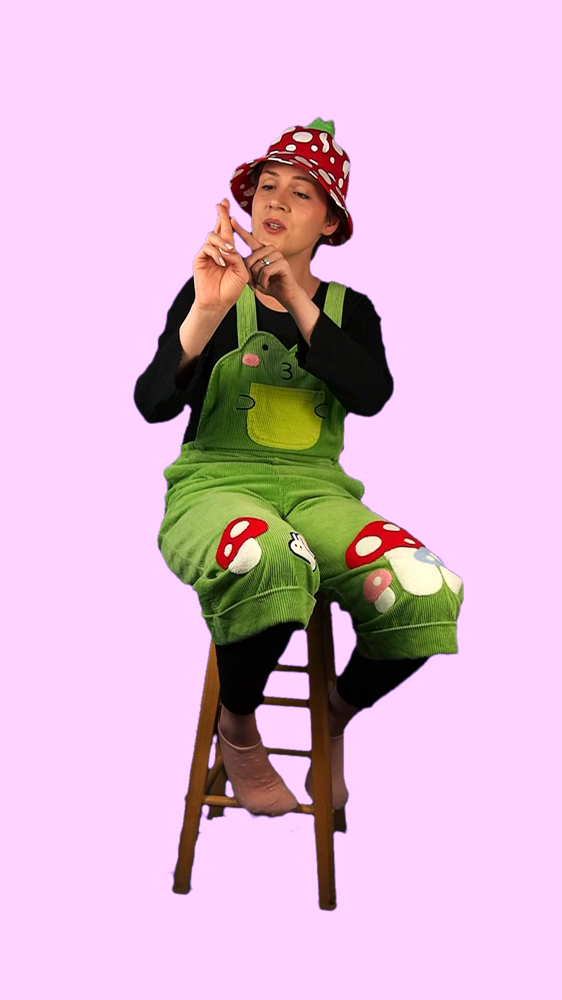


My wife has started producing children's music under the moniker of *Ms. Kiersten* and I'm helping with her video content,
learning VFX in Blender as I go.


## Filming Setup

I got a cheap set of lights and a backdrop stand on Amazon to set up a little studio in a weird attic room that we've only
been using for storage. I bought the blue screen separately as the set only came with a green backdrop that wouldn't work
with Kiersten's green overalls.

I wouldn't really recommend this set, but I needed some lights with softboxes on a budget. The main issue I have with it
is actually that the backdrop stands aren't as tall as I thought they would be so shooting anything standing up is not really
possible. As you can also see from this photo it was hard to get particularly even lighting across the modestly-sized screen.
I'll probably bring in some desk lamps to help get some more light onto the dark areas for now.

Because there isn't a lot of space, either in the room or within the bounds of the screen area I set up my camera vertically.
I figured this would at least give me the most resolution to work with. Below shows the framing of the shot straight out of
the camera. I intentionally underexposed the shot by shortening the exposure time as much as possible to limit the motion
blur. A faster lens would be better, but I don't have one at the same focal length and I'm limited by the size of our room.

## Preparing The Footage

The footage comes out of the camera in *.mov* format, 1920x1080 at 29.97 frames per second. The first step was to rotate
the footage to the vertical orientation and save it as a sequence of *tiff* images. This makes it easier to work with in blender,
and by rendering intermediate steps in a lossless format will prevent stacking any more compression artifacts onto the final
product. I was able to use Blender's video editing tools to do this conversion in a single step by rotating and scaling the video
in the strip's transform properties, and setting the render options to produce *tiff* files.

## Compositing
With the footage rotated and converted to an image sequence, the next step is actually keying out the
screen in the compositor. After enabling *use nodes* at the top of the view, I add a *Movie Clip* node
as the input, and the *Keying* node to do most of the work.

 

### Keying Screen Node
Initially I didn't get great results with
simple adjustments to the *keying* node parameters, but eventually while looking at the blender docs I
stumbled across the *Keying Screen* node which helped with a lot of the issues I was having. Basically
instead of inputting a single key color to the Keying node, a full image can be input instead. The
*Keying Screen* node generates an image to better represent the color of the screen at any given point,
thereby making up for the uneven lighting in the source footage. 

The *Keying Screen* node uses the same movie clip that we gave to the *Keying* node as an input, as well
as a tracking object which is a set of tracking points which it will sample to produce its image. In the
*Movie Clip Editor* set to tracking mode, a "bluescreen" object is added and tracking points are applied
around the clip in different areas of the backdrop as shown below. If the subject occludes any of the tracking
markers in the clip, the markers may be animated to move out of the way or enabled/disabled as appropriate.
The *Keying Screen* node will then produce an image for every frame of the clip which compensates for moving
shadows on the screen or other irregularities per-frame.

Here's an example of the output from the *Keying Screen* node for a frame of my clip.

As you can see, the changes in color across the screen are subtle, but it gives the *Keying* node a much
better color reference to work with than simply selecting a color from an arbitrary point on the backdrop.

### Garbage Mask
The other key (pun intended) to preparing the video clip for keying is setting up a garbage mask. In the
case of my footage the backdrop doesn't cover the whole frame, there's a bit of wall at the top and a bit
of floor at the bottom. There are also some particularly dark or wrinkled areas of the backdrop which 
could confuse the *Keying* node but fortunately aren't ever passed over by the subject. This is where
a garbage mask is used and fed into the Garbage Matte input of the *Keying* node.

The mask is authored in the *Movie Clip Editor* set to mask mode. Here a mask is drawn to cover the wall, floor,
and unused areas of the frame. In cases where the subject intersects the mask, the mask handles are animated
to make room. The mask for a frame of my clip is shown below.

This mask is selected as the input for the *Garbage Mask* node and fed into the *Keying* node's garbage matte
input. These masked areas will be completely excluded from the keying output.

### Keying Node
With the inputs for the key set up, all  that's left is to tweak the settings of the keying node to get a clean
matte. Attaching a viewer node to the matte output was a good way to get instant feedback on the effect my changes
were having. I don't really have any specific tips on what to change as it will largely depend on your footage, but
from the Blender docs I did at least learn that ideally the *clip black* value should be as low as possible and the
*clip white* value as high as possible to ensure the best separation. The direct output from the keying node's matte
output is shown below.

### Fixing Matte Issues
A bluescreen was used instead of a green one for obvious reasons here, but there is still a slight issue caused
by a light-blue mushroom design on the left leg. To fix this I had to create a supplemental mask just for that area.
The difference between the blue of the mushroom and the blue of the screen was enough to do it automatically, but not
within the parameters for keying the rest of the subject. For this I used another set of nodes to isolate this area
and create a matte with the specific color I wanted to preserve. This node setup is shown below.

Once again this was created through trial and error, but the gist is to pre-blur the image slightly, use the *color
key* node to isolate the color, dilate the mask and feather the edges. A mask was also used to confine the mask to
only the area directly around the mushroom design. The mask was created in the same way as the garbage mask, but
the shape was parented to a tracking marker to roughly follow the position. These masks were combined to produce
all black except for white in the desired area. These masks were then added together to produce the final mask for
the composite.

## The Final Result

With the mask applied to the video clip, it was overlaid over a solid color just to see the result. There are some
issues around the bottom of the stool which reflected the blue of the screen, but I was planning on cropping the clip
in anyway. When I composite it with an actual background I'll apply some color correction and clean up the edges with
a bit of a rimlight effect as well. 

I hope this was a helpful summation of my process for getting this chroma key from less-than-perfect footage. A
lot of the tutorials I looked at barely needed any manual adjustment to get a clean key, and didn't even mention the 
*Keying Screen* node, which I thought was extremely useful. Feel free to drop me a line on [mastodon](https://indieweb.social/@GandalfDG) or reach out via [email](mailto:jackacase+portfolio@gmail.com) with any questions or comments.
