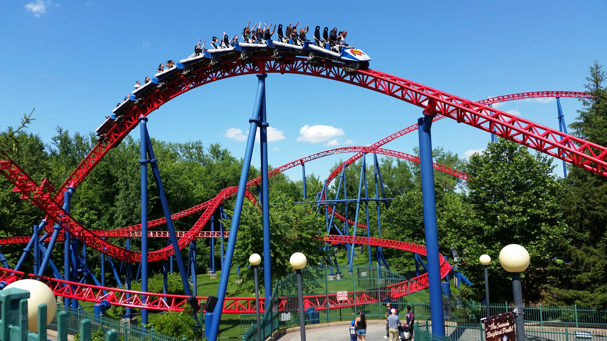


I heard the song *Ready to Go* by Republica on the radio and it got me thinking about
*Top Thrill Dragster*, roller coasters, and how I had to seek treatment for anxiety to
keep riding them.


## The Beginning

I wasn't an adrenaline-seeker as a child. During the summer our family would often visit
Land of Make-Believe in New Jersey, but apart from some fairground rides, it was
the waterpark that was the main attraction. I guess it was there that I *technically* got
my first coaster credit on *Thriller*, an E&F Miler oval layout with maybe a ten-foot drop.
That little ride didn't exactly launch my roller coaster obsession however.

](thriller_sue_barry.png "Thriller at Land of Make Believe - Photo by Sue Barry on *RCDB* https://rcdb.com/404.htm#p=7885")

My first "real" coaster was a big step up from the little *Thriller*, and it was
*Superman the Ride* at Six Flags New England, formerly *Bizarro* and before that
*Superman - Ride of Steel*. If you're familiar with the ride you're probably thinking
that's an ambitious first ride, and you'd be right. There are some taller, faster,
more intense coasters out there, but it's really the full package with a 200+ foot drop
sustained ejector and floater airtime, intense positive Gs in the spaghetti bowl section,
and all with wide open trains without anything obvious to hold on to. If I were to discover
the joys of roller coasters all over again, let's say it's not what I would have started with.
When your girlfriend (now my wife) wants to ride, what's a guy to do?

That first ride wasn't a great experience. We were seated in row two, so I had plenty of
time to contemplate the massive drop before leaving the lift chain. Once the drop began
it completely knocked the wind out of me and I couldn't breathe again for the entire
duration of the ride. Combine this with unexpectedly being forcefully thrown against
the leg restraints over the camelbacks and it was overall pretty traumatic. After
this ride I spent the rest of the day in the waterpark feeling the aftermath of nearly
collapsed lungs. I like to think I put a brave face on it, but I think everyone was
worried about me.

I dealt with this trauma in the only way I could think of. Since Kiersten enjoyed them so
much I knew I would have to ride again someday, so I started researching everything there
was to know about roller coasters. I watched videos, I read wikipedia articles, I learned
about different manufacturers and ride types. I hoped that with my new knowledge, and a
list of rides I thought looked incredible, that I would be able to overcome this bad
first experience. I *wanted* to overcome my fear and enjoy these massive marvels of
engineering.

## Finding my Footing

I took a chance and got myself a season pass to Six Flags for the next season. If I couldn't
hack it, at least it was a place between Kiersten and My family's homes where we could meet
up and cool off in the waterpark. Our first visit of the season was the tipping point. Here
was where I would find out once and for all if I was just obsessed with the idea and the
aesthetics of roller coasters, or if armed with all the knowledge I had gained I would truly
be able to appreciate them as intended, as a rider.

The ride I chose to ease back in was *Batman - The Dark Knight*, a custom B&M floorless. B&M,
I now knew, was renowned for their smooth rides so it seemed like a good way to get my feet wet
and experience my first inversions. It also helped that it has a curved drop rather than the 
intimidating straight drop of *Superman*. While it didn't blow me away, I managed to keep breathing
and even enjoy the sensations, especially of the zero-g roll in the middle of the layout.