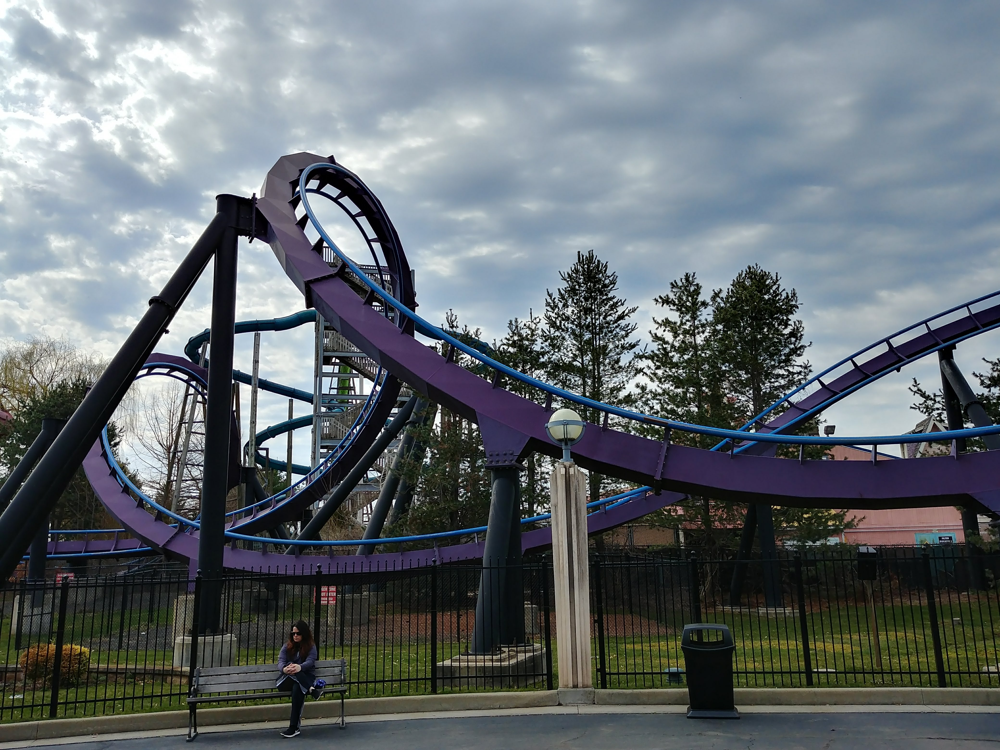
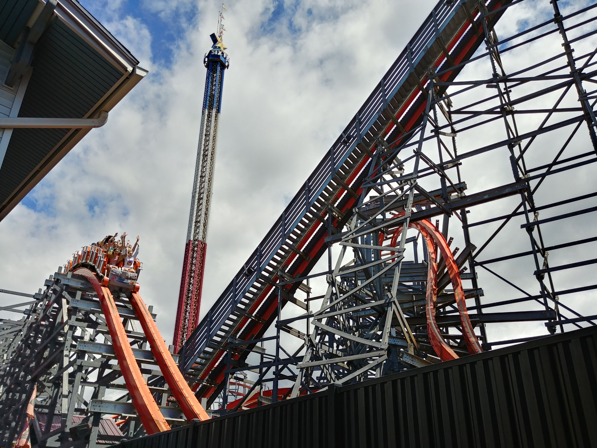


I heard the song *Ready to Go* by Republica on the radio and it got me thinking about
*Top Thrill Dragster*, roller coasters, and how I had to seek treatment for anxiety to
keep riding them.


## The Beginning

I wasn't an adrenaline-seeker as a child. During the summer our family would often visit
Land of Make-Believe in New Jersey, but apart from some fairground rides, it was
the waterpark that was the main attraction. I guess it was there that I *technically* got
my first coaster credit on *Thriller*, an E&F Miler oval layout with maybe a ten-foot drop.
That little ride didn't exactly launch my roller coaster obsession however.

](thriller_sue_barry.png "Thriller at Land of Make Believe - Photo by Sue Barry on *RCDB* https://rcdb.com/404.htm#p=7885")

My first "real" coaster was a big step up from the little *Thriller*, and it was
*Superman the Ride* at Six Flags New England, formerly *Bizarro* and before that
*Superman - Ride of Steel*. If you're familiar with the ride you're probably thinking
that's an ambitious first ride, and you'd be right. There are some taller, faster,
more intense coasters out there, but it's the full package with a 200+ foot drop,
sustained ejector and floater airtime, intense positive Gs in the spaghetti bowl section,
and all with wide open trains without anything obvious to hold on to. If I were to discover
the joys of roller coasters all over again, let's say it's not what I would have started with.
When your girlfriend (now my wife) wants to ride, what's a guy to do?

That first ride wasn't a great experience. We were seated in row two, so I had plenty of
time to contemplate the massive drop before leaving the lift chain. Once the drop began
it completely knocked the wind out of me and I couldn't breathe again for the entire
duration of the ride. Combine this with unexpectedly being forcefully thrown against
the leg restraints over the camelbacks and it was overall pretty traumatic. After
this ride I spent the rest of the day in the waterpark feeling the aftermath of nearly
collapsed lungs. I like to think I put a brave face on it, but I think everyone was
worried about me.

I dealt with this trauma in the only way I could think of. Since Kiersten enjoyed them so
much I knew I would have to ride again someday, so I started researching everything there
was to know about roller coasters. I watched videos, I read wikipedia articles, I learned
about different manufacturers and ride types. I hoped that with my new knowledge, and a
list of rides I thought looked incredible, that I would be able to overcome this bad
first experience. I *wanted* to overcome my fear and enjoy these massive marvels of
engineering.

## Finding my Footing

I took a chance and got myself a season pass to Six Flags for the next season. If I couldn't
hack it, at least it was a place between Kiersten and My family's homes where we could meet
up and cool off in the waterpark. Our first visit of the season was the tipping point. Here
was where I would find out once and for all if I was just obsessed with the idea and the
aesthetics of roller coasters, or if armed with all the knowledge I had gained I would truly
be able to appreciate them as intended, as a rider.

The ride I chose to ease back in was *Batman - The Dark Knight*, a custom B&M floorless. B&M,
I now knew, was renowned for their smooth rides so it seemed like a good way to get my feet wet
and experience my first inversions. It also helped that it has a curved drop rather than the 
intimidating straight drop of *Superman*. While it didn't blow me away, I managed to keep breathing
and even enjoy the sensations, especially of the zero-g roll in the middle of the layout.

I made it through a few more rides that day, though Superman was still off the agenda for
the time being. It wasn't until I got up the courage to ride Wicked Cyclone, Rocky Mountain
Construction's (RMC) reimagining of the Riverside Cyclone that it all clicked. The relentless
pops of ejector airtime, non-stop pacing, and buttery smoothness of RMC's i-box track got me
completely hooked. As soon as I got off I was ready to ride again.

## Travelling to Ride

One park's coaster collection isn't enough. There are so many iconic rides I
want to ride! At the end of a spring semester in Rochester, Kiersten and I took
a trip to Cedar Point in Ohio. We stopped along the way at the Erie Zoo, and
then made it to our hotel. The morning before actually entering the park I could
barely eat. I was so nervous to be so far from home, to be feeling unwell in an
unfamiliar place, and above all not wanting to spoil our enjoyment of this trip.
I was also nervously checking the weather. What would I do if rain stopped us
from riding anything at all? With ominous clouds rolling in we made our way into
the park. 

I had hoped to start the day with a ride on Gatekeeper which would be a smooth
and approachable B&M ride, but it wasn't running due to the impending weather.
Instead we got in line for Valravn, which intimidated me with its 200'
completely vertical drop. Still not feeling 100% we boarded the train and there
was no turning back. As we dropped straight down feeling the first drops of
rain from the gathering storm, the wave of adrenaline washed over me and my mind
and body remembered that in fact, I love rollercoasters. What a relief!

We thoroughly enjoyed the rest of our stay at Cedar point, riding all of their
great coasters. While we were most excited about the new Steel Vengeance, it was
Maverick that truly stole my heart. It's a ride that proves that record-breaking
drops and top speeds aren't what makes a coaster most enjoyable. That said, it was
the tallest, fastest ride at the park, *Top Thrill Dragster* which still worried me.

## Top Thrill Dragster

*Top Thrill Dragster*'s 420 foot tophat element is a landmark feature of Cedar Point's
skyline. Walking alongside the launch track where trains are accelerated to top speed
by the powerful hydraulic cable system 
