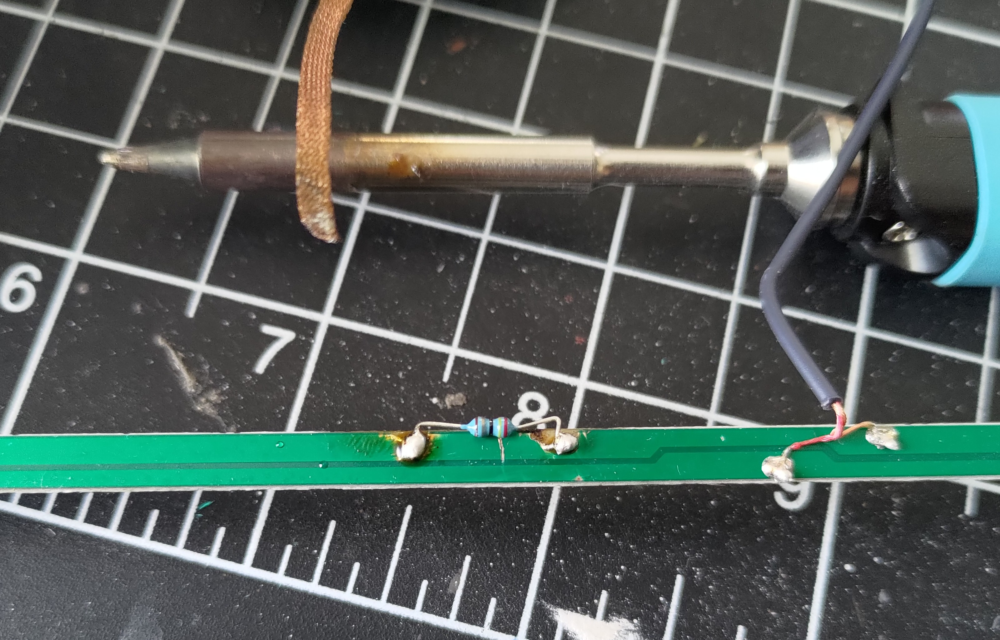


My wife's old Wii was in a box in our basement with a broken disc drive and no sensor bar. I setup homebrew to load games
from an SD card, but the replacement sensor bar I ordered had some issues.


I always wanted a Wii when I was in elementary school at the height of its popularity, but until finally getting a Switch in
the pandemic all of my gaming was done on a PC or a handheld. With the busted Wii sitting in the basement I knew it was
only a matter of time until I set it up to enjoy all of the fun I missed out on. I installed homebrew following the excellent
instructions on the [Wii Hacks Guide](https://wii.hacks.guide/) to circumvent the faulty disc drive. The sensor bar I ordered
worked fine for about a week, but that was all it had in it.

## Troubleshooting

I took a look at the sensor bar with my phone camera to see the IR emitters and found that only one side was still emitting
IR. I popped the case open to discover a dead-simple circuit board with a major and easily remedied flaw. Take a look at the
schematic I drew up and see if you can spot the issue.

If you took one look at it and asked "why is there only one resistor?" you'd be on track. Yes, this PCB was designed with a
current-limiting resistor, but only for half of the LEDs. I asked the seller for a replacement, but I knew that another one 
would just burn out in the exact same way. However, with how simple the circuitry inside was I figured I could bodge in
a resistor for the other three LEDs and have a perfectly functional sensor bar.

## Repair

When the replacement arrived I had all I needed to add a resistor to the other half of the LEDs. I desoldered the 100Ω
resistor from the donor PCB (not a resistor value I had lying around) and then started work on the new PCB. I used a hobby
knife to sever the ground trace on the side without the resistor, and then scraped away the solder mask on either side of
the cut trace. Then I applied some solder to the newly exposed copper and soldered the extra resistor in place. I checked
my connections with the multimeter to ensure I hadn't left a short between the resistor legs and snapped the case back together.

## Conclusion

I wouldn't recommend getting one of these crummy replacement sensor bars, but I'm glad I was able to make one working one
out of two faulty ones. It was tricky getting the solder mask off the board without scraping away the tiny copper layer so
even this repair isn't a great fix, but for reviving a barely-working Wii it's done the job with minimal investment.

Also I just want to mention the Pinecil soldering iron I used for this project as a really excellent low-cost soldering
iron that can run on almost any power source and heats up in seconds. Check it out at [pine64.com](https://pine64.com/product/pinecil-smart-mini-portable-soldering-iron/).