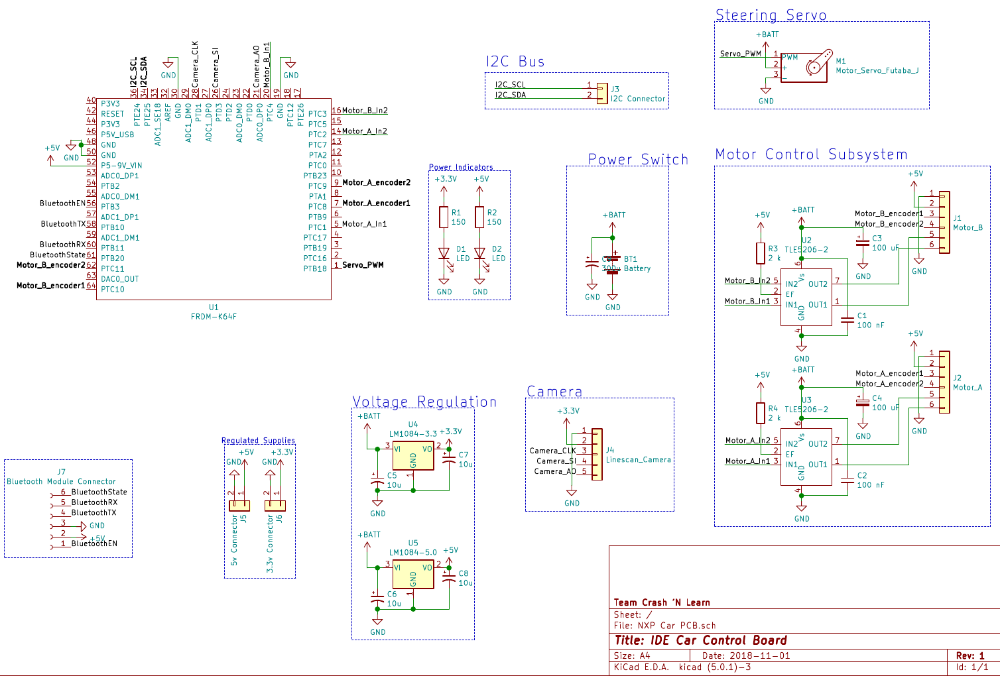
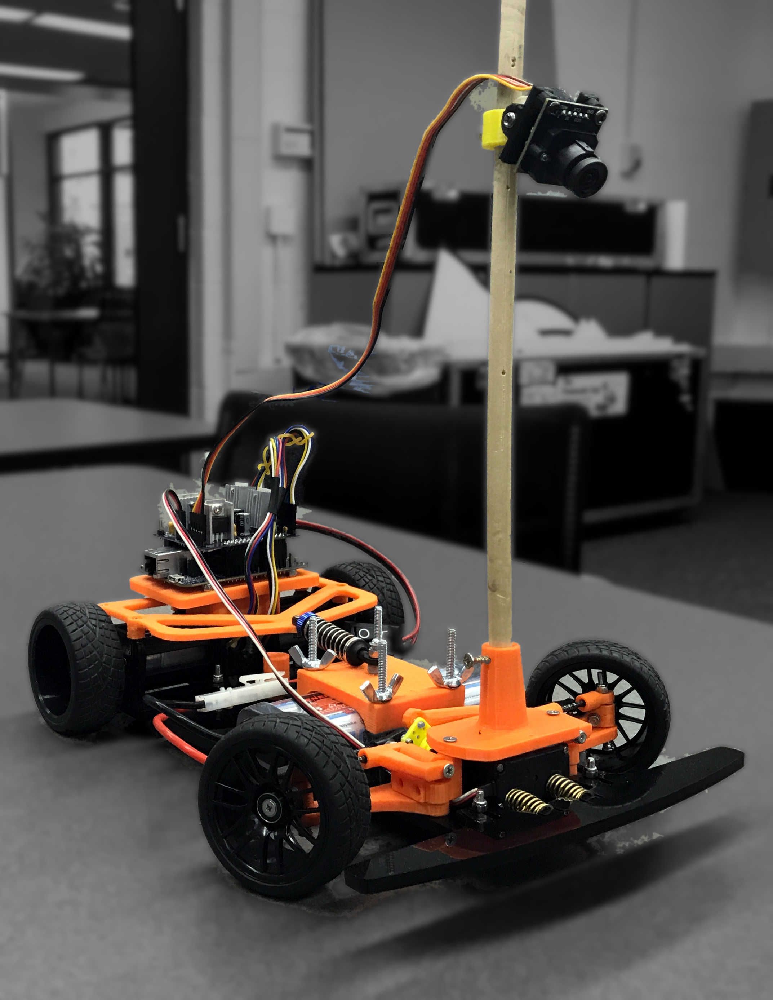

In my senior year at RIT I was part of a team tasked with building a small vehicle to replace the vehicle
provided for the defunct *Freescale Cup* competition.

Programming the microcontroller for the *Freescale Cup* vehicle was also used as part of the curriculum for the 
*Interface and Digital Electronics* course for Computer Engineering majors. As the car was no longer being produced,
a substitute needed to be designed to allow the project to continue being used for the class.

## The Freescale Cup

The *Freescale Cup* was a competition to program a standard vehicle with a microcontroller to navigate around an arbitrary
track using only input from a simple camera. The track was made up of white plastic sections with a black line along each edge.
The general strategy was to process the camera input and use it to steer the vehicle and control its speed. A simple software
implementation could drive the car around the track successfully, but to achieve better times more complex algorithms could be
developed to increase straight-line speed, and improve cornering performance among other optimizations.

Using standardized vehicle hardware and track construction allowed the *Freescale Cup* to be a competition focused on software
development, without the vehicles themselves providing advantages from other modifications. Unfortunately after Freescale was
acquired by NXP the competition was phased out, as was the physical vehicle. Since the car was being used as part of the Computer
Engineering curriculum at RIT, a replacement was needed.


Now the NXP cup seems to be back with a newly designed vehicle, but at the time of our project in 2018 it had been phased out.


## Design Requirements

The main requirements of the project were to design a vehicle which would be able to navigate the existing track pieces, and use
some of the existing common hardware from the original car, such as batteries, cameras, and microcontroller.
Beyond this the goal was to be able to produce the chassis with common makerspace
tools, such as a 3D printer and laser cutter. The BOM cost was also a factor, with a desired cost under $300 per vehicle.
The original car was also prone to burning itself up with undersized traces on the interface PCB and undersized motors not
rated for the full power of the battery. Not ideal for an expensive toy car for students to use.

With these requirements in mind the MechEs set off on designing the chassis, and the electrical and CEs (myself included) started
picking electrical components to drive the car and interface with the K64 microcontroller board.

## PCB Design

With the drive motors and other required components picked out, I started designing the interface PCB to connect the K64 microcontroller 
board to the car's sensors and actuators. The PCB was designed to sandwich onto the microcontroller board
in the style of an Arduino shield to eliminate the need for jumper wires to connect the board and the car (which was another
issue with the original car). I had previously designed a PCB in Eagle for a class project, but this time I decided to try out
the open-source alternative, [KiCad](https://www.kicad.org/). I appreciated the workflow of designing a schematic first and then
assigning footprints to the components after, which is opposite the approach of Eagle. I found this a lot more intuitive.

Creating the schematic involved selecting the pin assignments for all of the microcontroller connections, which involved a bit of
guess and check, since the microcontroller has a lot of integrated peripherals, but only certain ones can be assigned to certain pins.
I was eventually able to figure out a way to have all of the needed peripherals connected with some extra pins to spare. In total, each
drive motor needed two pins capable of PWM to control their speed and direction, and two pins for their integrated quadrature encoders. 
The steering servo needed a PWM pin, the camera needed three pins for clock, control, and data. Additionally an I2C bus was exposed for
connecting peripherals, and later on SPI was also exposed for a bluetooth module that could be used for wireless communication.

After the schematic came the actual PCB layout. Since the car was supposed to be easy to assemble, I wanted to use all through-hole
components. Additionally I wanted to keep within the size of the K64 board itself. Within those parameters I was able to design a
compact two-layer board with oversized traces for the high-current areas.

Not to brag, but it only took 2 runs of the board to get it to fit on top of the microcontroller properly 😅

")

## Software Implementation

The software I wrote to demonstrate the car was written in C++ using FreeRTOS. As I had done this project in
my previous year at RIT I took this as an opportunity to learn new things. In this case, writing in C++ instead
of C which I had used in most of my school projects to this point as well as using FreeRTOS rather than the fragile
timing-loop-based implementation that our group used in that previous incarnation.

## Demonstration

Our group demonstrated our final product at the [Imagine RIT](https://www.rit.edu/imagine/) festival where our car was able to successfully navigate the track in a respectable time. If there had been more time to finish the software I would have implemented more advanced control
and spent more time tuning, but at the end of the day we achieved our goal.

<iframe title="Autonomous Car Demo" width="100%" height="100%" src="https://spectra.video/videos/embed/bc7cac72-b29d-44c9-a888-4687f2adf902?loop=1&amp;muted=1&amp;warningTitle=0&amp;peertubeLink=0&amp;p2p=0" frameborder="0" allowfullscreen="" sandbox="allow-same-origin allow-scripts allow-popups" style="position: absolute; inset: 0px;"></iframe>

