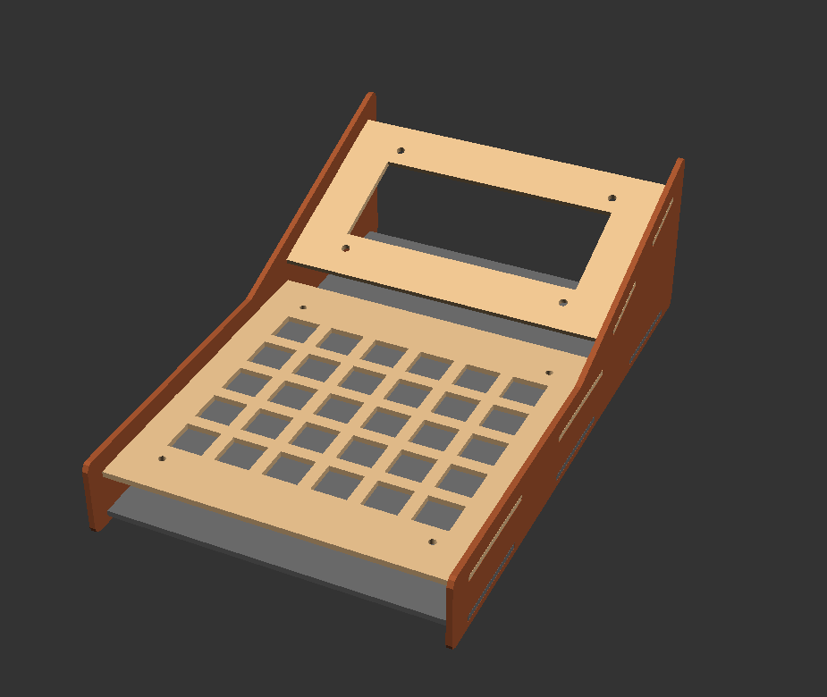
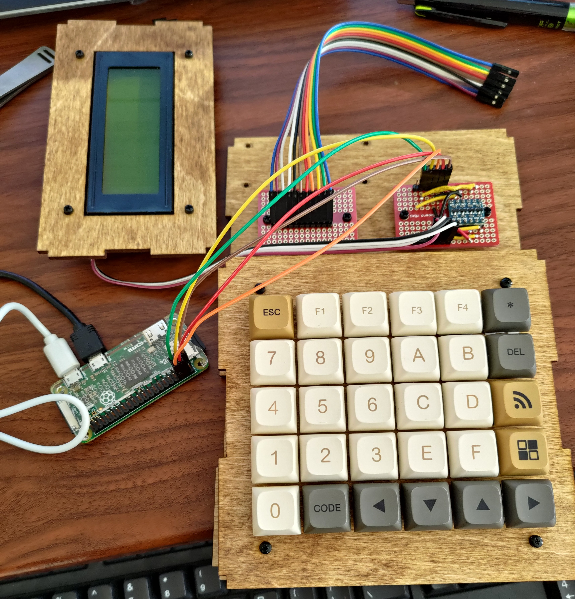
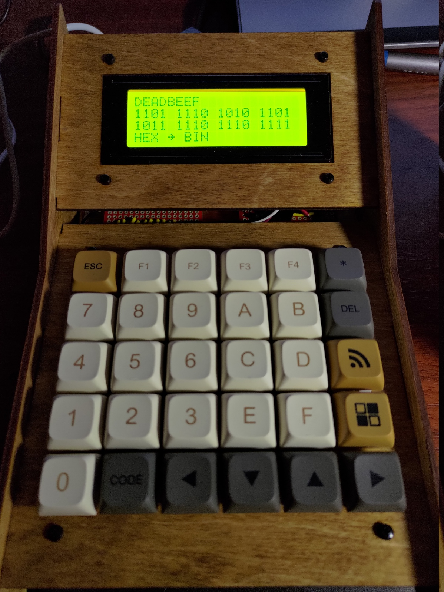


Why don't they make programmer's calculators anymore?


When you work in embedded software development, you'll need to convert numbers to and from hex and binary from time to time,
and when you do wouldn't it be nice to have a handy device with nice clicky buttons on your desk ready to go? Well that's what
I wanted, and barring old models on ebay (likely ruined by leaky batteries) there's nowhere you can buy a simple calculator 
that handles hex and binary.

## Part Selection

With that minor gripe in mind I started dreaming up my perfect desktop companion. Something with physical buttons that's always
on, so I don't have to fiddle around with an on-screen calculator. I had a Raspberry Pi Zero that I wasn't using for anything,
so that became the heart of the project. Overkill? Definitely, but I was also looking for a project to force me to learn more
about Linux kernel drivers, so it made sense for me. Also, with an entire Linux computer inside, this calculator could really be
used for anything you'd like to have at your fingertips.

For optimum clicky clacky feel I knew I wanted to use mechanical keyswitches for this device. Looking around on [Adafruit](https://www.adafruit.com/)
I found their handy [NeoKey PCB](https://www.adafruit.com/product/5157) which is a board pre-assembled with keyswitch sockets, diodes
and NeoPixel LEDs in a grid. The PCB can be snapped apart to create different layouts, but I opted to just keep it as one piece and
use all of the keys in the prewired grid configuration.

 used under [Attribution-ShareAlike Creative Commons](https://creativecommons.org/licenses/by-sa/3.0/))")

For the final major component I opted for a 20x4 character LCD with a backlight. I used one with an i2c interface board attached to it
to reduce the pin count needed on the Raspberry Pi.

## Case Design

I designed the case in [OpenSCAD](https://openscad.org/) to be cut by laser cutter. It was a fun and rewarding experience specifying
my design in code, though the usual visual CAD programs are definitely much faster to work with. Not sure if I would use *OpenSCAD*
again for a project like this, but it worked out well for this one. It lent itself particularly well to defining the keyswitch cutouts
as a nested loop. Where it falls down is in specifying even simple polygons point by point. You definitely take all the math going on
behind the scenes in graphical CAD programs for granted. 


My *OpenSCAD* code for the case can be found on my [*ProMacroPad* repository on GitHub](https://github.com/GandalfDG/ProMacroPad/) in the *case/* directory along with the circuit design files and software.


## Electrical

I made an electrical schematic in [KiCad](https://www.kicad.org/) though I wasn't creating a PCB for this project. The schematic was just
used to make sure I was connecting the right pins between components. The circuit boards were mainly consolidating the keypad matrix wires
without any real components on the boards, other than a level shifter for the i2c bus. The level shifter was needed because the i2c backpack
on the character lcd was 5V and the Pi Zero works with 3.3V IO.

## Assembly

The keypad board was screwed to the front plate and the keyswitches were inserted. Wires were then soldered to the PCB to break out the row
and column lines of the matrix. The character LCD was screwed to its mounting plate, and the remaining PCBs and the Pi Zero were screwed to the bottom of the case. Assembly was pretty straightforward other than the height of the jumper wire connectors making for a tight fit when
the case was finally assembled.

## Software

The software was the most interesting and educational part of the project. While I didn't have to write any drivers from scratch, I did need
to make patches to two different existing drivers to get things working the way I wanted. The first was the *lcdi2c* driver by 
[lucidm on GitHub](https://github.com/lucidm/lcdi2c) to drive the display, which just required fixing a few compile errors. The second was
the *matrix_keypad* Linux driver which allows reading from a matrix such as the one on the calculator on GPIO pins. The issue with this
driver was that it wouldn't support multiple simultaneous keypresses in the same row, because it was relying on an interrupt being fired
when a key is pressed. This works fine for a small numerical keypad or similar device where you'd only be typing with one finger, but for
this application it would cause dropped keystrokes when typing in numbers quickly as I found during testing. My solution was to have the 
driver poll the matrix on an interval while a key is held down, which eliminated the issue. Not ideal to introduce polling, but it worked
for this application.  

With the drivers sorted out I was able to implement a simple application in Python to control the display and accept input from the keypad.
I planned on making more "apps" for the device but never really got around to it. The advantage of the application software being written
in Python is that the barrier to entry for writing additional features for this device is low. This was important to me as I wanted this
device to be completely open hardware and software, allowing others who might want such a thing to be able to do whatever they want with it.

The final piece to getting everything up and running was writing a device tree overlay to map the keypad matrix rows and columns to their
corresponding GPIO pins, and the map defining what each key should represent internally. I laid out the keys in a way that made sense for
my application, but any keycaps could be placed anywhere on the keypad for different applications and so this is how their functions are
configured (or at least how they appear to the kernel).