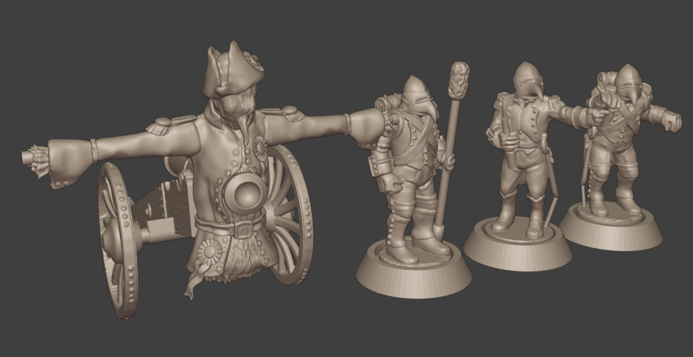
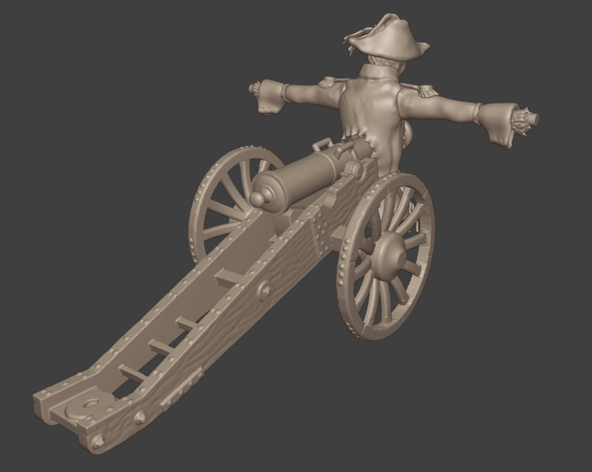
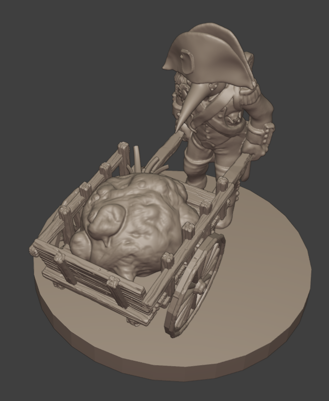
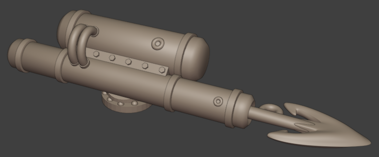
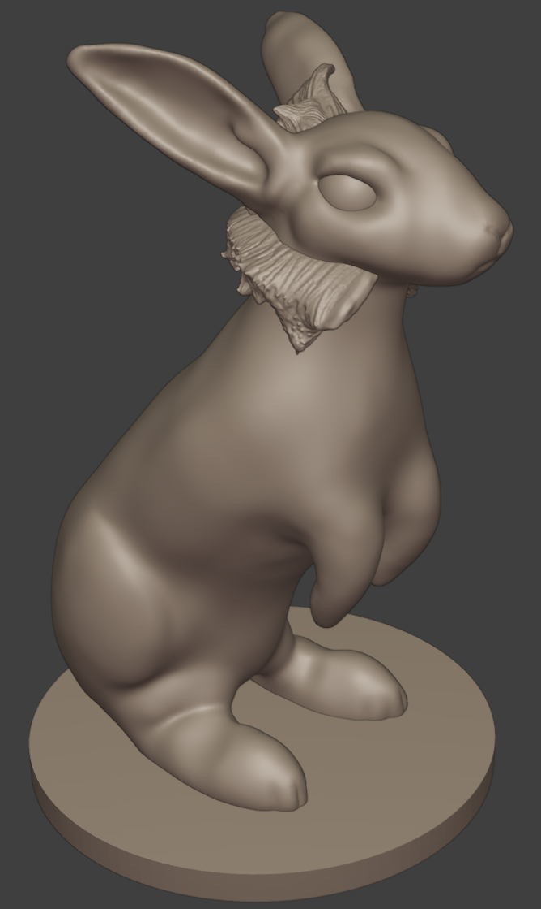
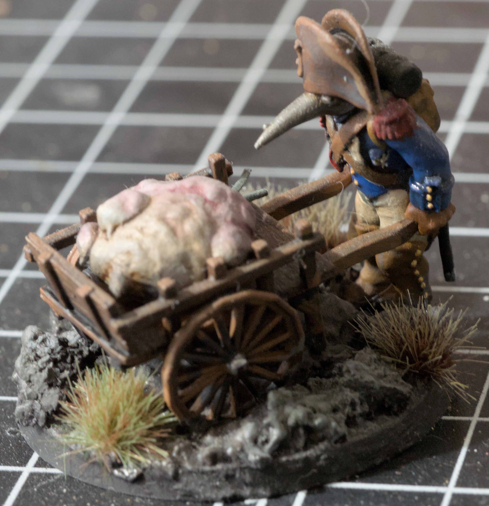


I've been dabbling with Blender since high school for various purposes. Most recently I've been using it to model organic and hard-surface
objects for 3D printing and painting.


## Sculpting and Kitbashing for 3D Printing

Because I enjoy painting wargaming miniatures, a resin 3D printer was a no-brainer for expanding my collection without breaking the bank.
There are a great number of miniature-agnostic games out there these days, and with some 3D modeling skill and a printer you can build
up an army for any system and customize it exactly to your liking. 

The systems that inspired me to try my hand at sculpting original
models as well as kitbashing existing ones were [Turnip28](https://www.patreon.com/Turnip28) and [Gaslands](https://planetsmashergames.com/gaslands/about/). Turnip28's surreal and twisted setting inspired me to modify existing napoleonic models by replacing heads, altering
poses, and adding decorations. In the case of the cannon model shown below I converted a model into a scarecrow with the cannon barrel piercing its chest, which was a very fun conversion and I think made a very effective model when printed and painted. 

For Gaslands I used 3D printing to augment existing Hotwheels cars with crazy weapons. I modeled this harpoon gun with polygonal modeling techniques and found a model of a winch online to complete the car.


  
  
  
  
  <!--  -->
  
  
  


