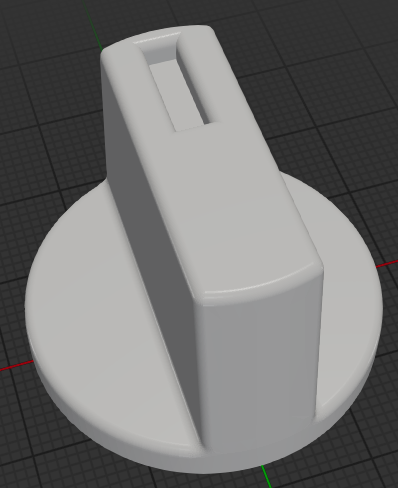
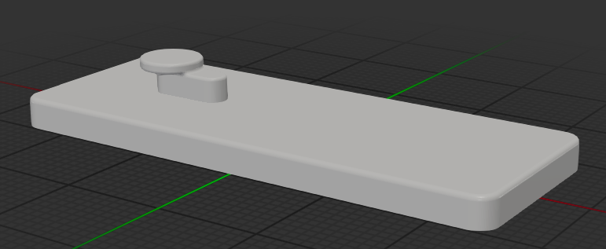
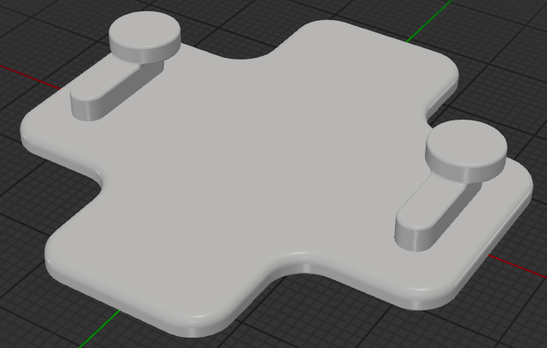
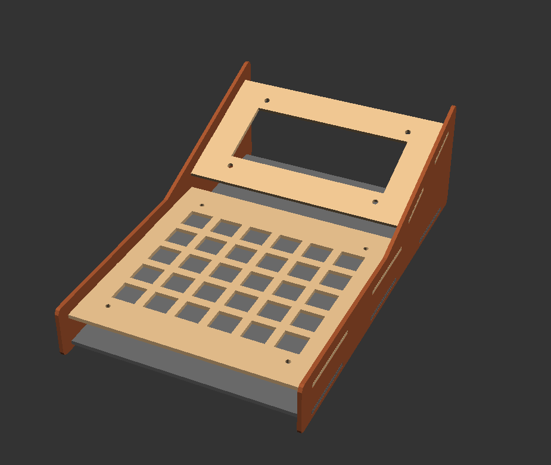
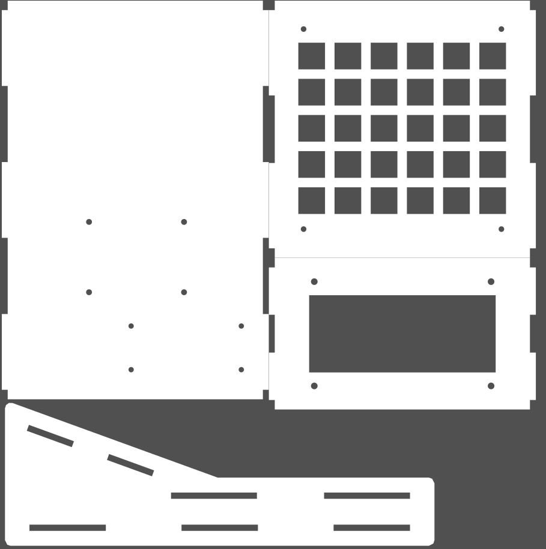


I've used various CAD programs to design parts for laser cutting and 3D printing.


From 3D printable replacement parts and mounting solutions used around the house, to a custom laser-cuttable case for my [ProMacroPad](/projects/programmers_calculator) project I've used FreeCAD, OpenSCAD and CadQuery. FreeCAD is a traditional GUI-based CAD program that I used to design a replacement knob for the dishwasher in our apartment. 

OpenSCAD and CadQuery instead use a code-based approach to
designing parts. I used CadQuery to design a keyhole mounting system in Python to hang things on the wall with command strips rather than
needing a screw or a nail to hang them. The code-based approach allowed this keyhole design to be packaged as a reusable library. In this
case I reused the keyhole feature on different mounting plates and placed and sized them accurately using measurements taken from the objects
to be hung up. 

I used OpenSCAD to design the case for my [ProMacroPad](/projects/programmers_calculator), though having later found cadquery I probably
wouldn't reach for OpenSCAD again. It's easier to use my existing Python knowledge than to use OpenSCAD's own language.


  
  
  
  
  

